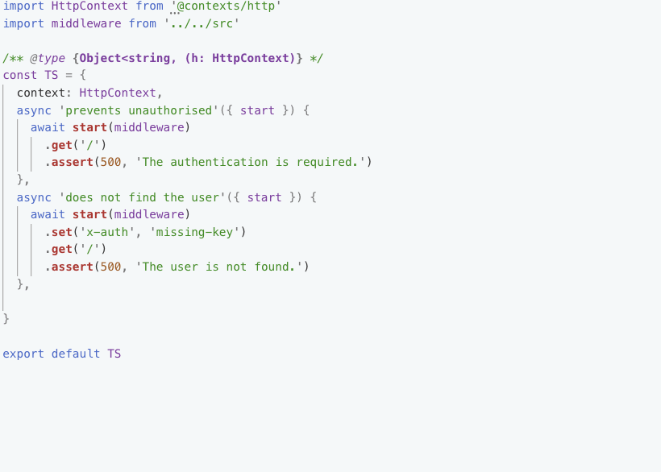
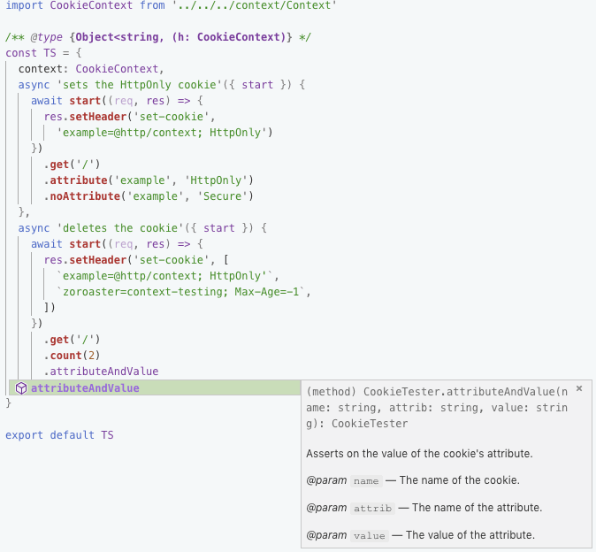

# @contexts/http

[](https://npmjs.org/package/@contexts/http)

`@contexts/http` is The Http(s) Testing Context For Super-Test Style Assertions. Includes Standard Assertions (get, set, assert), And Allows To Be Extended With JSDocumented Custom Assertions.

```sh
yarn add @contexts/http
```

## Table Of Contents

- [Table Of Contents](#table-of-contents)
- [API](#api)
- [class HttpContext](#class-httpcontext)
  * [`start(fn: (req: IncomingMessage, res: ServerResponse), secure: boolean=): Tester`](#startfn-req-incomingmessage-res-serverresponsesecure-boolean-tester)
  * [`startPlain(fn: (req: IncomingMessage, res: ServerResponse), secure: boolean=): Tester`](#startplainfn-req-incomingmessage-res-serverresponsesecure-boolean-tester)
  * [`listen(server: http.Server|https.Server): Tester`](#listenserver-httpserverhttpsserver-tester)
  * [`debug(on: boolean=)`](#debugon-boolean-void)
- [class Tester](#class-tester)
  * [`get(path: string=): Tester`](#getpath-string-tester)
  * [`head(path: string=): Tester`](#headpath-string-tester)
  * [`assert(code: number, body: (string|RegExp|Object)=): Tester`](#assertcode-numberbody-stringregexpobject-tester)
  * [`assert(header: string, value: ?(string|RegExp)): Tester`](#assertheader-stringvalue-stringregexp-tester)
  * [`assert(assertion: function(Aqt.Return)): Tester`](#assertassertion-functionaqtreturn-tester)
    * [`AqtReturn`](#type-aqtreturn)
  * [`set(header: string, value: string): Tester`](#setheader-stringvalue-string-tester)
  * [`session(): Tester`](#session-tester)
- [Extending](#extending)
- [CookiesContext](#cookiescontext)
- [Copyright](#copyright)

<p align="center"><a href="#table-of-contents"></a></p>

## API

The package is available by importing its default and named classes. When [extending](#extending) the context, the `Tester` class is required. The [_CookiesContext_](#CookiesContext) is an extension of the _HttpContext_ that provides assertions for the returned `set-cookie` header.

```js
import HttpContext, { Tester } from '@contexts/http'
import CookiesContext, { CookiesTester } from '@contexts/http/cookie'
```

<p align="center"><a href="#table-of-contents"></a></p>

## class HttpContext

This testing context is to be used with [_Zoroaster Context Testing Framework_](https://contexttesting.com). Once it is defined as part of a test suite, it will be available to all inner tests via the arguments. It allows to specify the middleware function to start the server with, and provides an API to send requests, while setting headers, and then assert on the result that came back. It was inspired by `supertest`, but is asynchronous in nature so that no `done` has to be called &mdash; just the promise needs to be awaited on.

<table>
<tr><th>Using <em>HttpContext</em> Example</th></tr>
<tr><td>

```js
const users = {
  'secret-token': 'ExampleUser',
}

/**
 * User Authentication Route.
 * @param {http.IncomingMessage} req
 * @param {http.ServerResponse} res
 */
const middleware = (req, res) => {
  const token = req.headers['x-auth']
  if (!token) throw new Error('The authentication is required.')
  const user = users[token]
  if (!user) throw new Error('The user is not found.')
  res.setHeader('set-cookie', `user=${user}`)
  res.end(`Hello, ${user}`)
}

export default middleware

/**
 * @typedef {import('http').IncomingMessage} http.IncomingMessage
 * @typedef {import('http').ServerResponse} http.ServerResponse
 */
```
</td></tr>
<tr><td>
For example, we might want to test some synchronous middleware. It will check for the authentication token in the headers, reject the request if it is not present, or if the corresponding user is not found, and write the response if everything is OK.
</tr></td>
<tr><td>

<a href="example/test/spec/default.js">
  
</a>
</td></tr>
<tr><td>The tests are written for <em>Zoroaster</em> in such a way that test suite objects are exported. When the <code>context</code> property is found on the test suite, it will be instantiated for all inner tests. The <code>start</code> method will wrap the request listener in try-catch block to send statuses <em>200</em> and <em>500</em> accordingly (see below).
</td></tr>
<tr><td>

```
example/test/spec/default.js
  ✓  prevents unauthorised
  ✓  does not find the user
  ✓  authenticates known user

🦅  Executed 3 tests.
```
</td></tr>
<tr><td>The tests can be run with <em>Zoroaster</em> test runner: <code>zoroaster example/test/spec -a</code>.
</td></tr>
</table>

<p align="center"><a href="#table-of-contents"></a></p>


### `start(`<br/>&nbsp;&nbsp;`fn: (req: IncomingMessage, res: ServerResponse),`<br/>&nbsp;&nbsp;`secure: boolean=,`<br/>`): Tester`

Starts the server with the given request listener function. It will setup an upper layer over the listener to try it and catch any errors in it. If there were errors, the status code will be set to `500` and the response will be ended with the error message. If there was no error, the status code will be set by _Node.JS_ to `200` automatically, if the request listener didn't set it. This is done so that assertion methods can be called inside of the supplied function. If the server needs to be started without the wrapper handler, the [`startPlain`](#startplainfn-req-incomingmessage-res-serverresponsesecure-boolean-tester) method can be used instead.

When the `secure` option is passed, the HTTPS server with self-signed keys will be started and `process.env.NODE_TLS_REJECT_UNAUTHORIZED` will be set to `0` so make sure this context is only used for testing, and not on the production env.

```js
// the handler installed by the `start` method.
const handler = async (req, res) => {
  try {
    await fn(req, res)
    res.statusCode = 200
  } catch (err) {
    res.statusCode = 500
    res.write(err.message)
    if (this._debug) console.error(error.stack)
  } finally {
    res.end()
  }
}
server.start(handler)
```

<table>
<tr><th>Middleware Constructor Testing Strategy</th></tr>
<tr><td>

```js
/**
 * Creates a middleware for the given list of users.
 * @param {Object<string, string>} users
 */
const makeMiddleware = (users) => {
  /**
   * Updates the request to have the user information if the token is found.
   * @param {http.IncomingMessage} req
   */
  const middleware = (req) => {
    const token = req.headers['x-auth']
    const user = users[token]
    if (user) req['user'] = user
  }
  return middleware
}

export default makeMiddleware

/**
 * @typedef {import('http').IncomingMessage} http.IncomingMessage
 * @typedef {import('http').ServerResponse} http.ServerResponse
 */
```
</td></tr>
<tr><td>We update the source code to export a constructor of middleware, based on the given options. In this case, the middleware will be created with the <code>users</code> object that is scoped within the function, rather that file, so that we can pass it at the point of creating the middleware.</td></tr>
<tr><td>

```js
import { ok, equal } from 'assert'
import HttpContext from '@contexts/http'
import createMiddleware from '../../src/constructor'

class Context {
  /**
   * Creates a request listener for testing.
   * @param {function(http.IncomingMessage, http.ServerResponse)} next
   * Assertion method.
   * @param {Object<string, string>} [users] The list of tokens-users.
   */
  c(next, users = {}) {
    return (req, res) => {
      const mw = createMiddleware(users)
      mw(req, res) // set the user on request
      next(req, res)
    }
  }
}

/** @type {Object<string, (c: Context, h: HttpContext)} */
const TS = {
  context: [Context, HttpContext],
  async 'does not set the user without token'({ c }, { start }) {
    await start(c((req) => {
      ok(!req.user)
    }))
      .get('/')
      .assert(200)
  },
  async 'does not set the user with missing token'({ c }, { start }) {
    await start(c((req) => {
      ok(!req.user)
    }), { 'secret-token': 'User' })
      .set('x-auth', 'missing-token')
      .get('/')
      .assert(200)
  },
  async 'sets the user with https'({ c }, { start }) {
    await start(c((req) => {
      ok(req.user)
      ok(req.connection.encrypted)
    }, { 'secret-token': 'User' }), true)
      .set('x-auth', 'secret-token')
      .get('/')
      .assert(200)
  },
  async 'sets the correct name'({ c }, { start }) {
    await start(c((req) => {
      equal(req.user, 'Expected-User')
    }, { 'secret-token': 'Actual-User' }))
      .set('x-auth', 'secret-token')
      .get('/')
      .assert(200) // expecting fail
  },
}

export default TS

/**
 * @typedef {import('http').IncomingMessage} http.IncomingMessage
 * @typedef {import('http').ServerResponse} http.ServerResponse
 */
```
</td></tr>
<tr><td>The new tests require implementing a method that will call the middleware constructor prior to continuing with the request. This method is creates as part of a different context, called simply <em>Context</em>. It will help to create the request listener to pass to the <code>start</code> method, where the assertions will be written in another middleware executed after the source code one.</td></tr>
<tr><td>

```
example/test/spec/constructor.js
  ✓  does not set the user without token
  ✓  does not set the user with missing token
  ✓  sets the user with https
  ✗  sets the correct name
  | Error: 500 == 200 'Actual-User' == 'Expected-User'
  |     at sets the correct name (/Users/zavr/idiocc/http/example/test/spec/constructor.js:54:8)

example/test/spec/constructor.js > sets the correct name
  Error: 500 == 200 'Actual-User' == 'Expected-User'
      at sets the correct name (/Users/zavr/idiocc/http/example/test/spec/constructor.js:54:8)

🦅  Executed 4 tests: 1 error.
```
</td></tr>
<tr><td>We expected the last test to fail because in the assertion method we specified that the user name should be different from the one that was passed in the options to the middleware. Other tests pass because there were no errors in the assertion middleware. It is always required to call <code>assert</code> on the context instance, because simply requesting data with <code>get</code> will not throw anything even if the status code was not <em>200</em>.</td></tr>
</table>

<p align="center"><a href="#table-of-contents"></a></p>

### `startPlain(`<br/>&nbsp;&nbsp;`fn: (req: IncomingMessage, res: ServerResponse),`<br/>&nbsp;&nbsp;`secure: boolean=,`<br/>`): Tester`

Starts the server without wrapping the listener in the handler that would set status `200` on success and status `500` on error, and automatically finish the request. This means that the listener must manually do these things. Any uncaught error will result in run-time errors which will be caught by _Zoroaster_'s error handling mechanism outside of the test scope, but ideally they should be dealt with by the developer. If the middleware did not end the request, the test will timeout and the connection will be destroyed by the context to close the request.

<table>
<tr><th>Plain Listener Testing</th><th>Wrapper Listener Testing</th></tr>
<tr><td>

```js
import Http from '@contexts/http'

/** @type {Object<string, (h: Http)} */
const TS = {
  context: Http,
  async 'sets the status code and body'(
    { startPlain }) {
    await startPlain((req, res) => {
      res.statusCode = 200
      res.end('Hello World')
    })
      .get('/')
      .assert(200, 'Hello World')
  },
  // expect to fail with global error
  async 'throws an error'({ startPlain }) {
    await startPlain(() => {
      throw new Error('Unhandled error.')
    })
      .get('/')
  },
  // expect to timeout
  async 'does not finish the request'(
    { startPlain }) {
    await startPlain((req, res) => {
      res.write('hello')
    })
      .get('/')
  },
}

export default TS
```
</td>
<td>

```js
class C {
  c(listener) {
    return (req, res) => {
      try {
        listener(req, res)
      } catch (err) {
        res.statusCode = 500
      } finally {
        res.end()
      }
    }
  }
}

/** @type {Object<string, (c:C, h: Http)} */
export const handled = {
  context: [C, Http],
  async 'throws an error'({ c },
    { startPlain }) {
    await startPlain(c(() => {
      throw new Error('Unhandled error.')
    }))
      .get('/')
      .assert(500)
  },
  async 'times out'({ c }, { startPlain }) {
    await startPlain(c((req, res) => {
      res.write('hello')
    }))
      .get('/')
      .assert(200, 'hello')
  },
}
```
</td></tr>
<tr><td colspan="2">With plain listener testing, the developer can test the function as if it was used on the server without any other middleware, such as error handling or automatic finishing of requests. The listener can also be wrapped in a custom service middleware that will do these admin things to support testing.</td></tr>
<tr><td colspan="2">

```
example/test/spec/plain
   handled
    ✓  throws an error
    ✓  times out
   plain
    ✓  sets the status code and body
    ✗  throws an error
    | Error: Unhandled error.
    |     at startPlain (/Users/zavr/idiocc/http/example/test/spec/plain/plain.js:18:13)
    |     at Server.handler (/Users/zavr/idiocc/http/src/index.js:90:15)
    ✗  does not finish the request
    | Error: Test has timed out after 200ms

example/test/spec/plain > plain > throws an error
  Error: Unhandled error.
      at startPlain (/Users/zavr/idiocc/http/example/test/spec/plain/plain.js:18:13)
      at Server.handler (/Users/zavr/idiocc/http/src/index.js:90:15)

example/test/spec/plain > plain > does not finish the request
  Error: Test has timed out after 200ms

🦅  Executed 5 tests: 2 errors.
```
</td></tr>
<tr><td colspan="2">The output shows how tests with listeners that did not handle errors fail, so did the tests with listeners that did not end the request. The <code>handled</code> test suite (on the right above), wraps the plain listener in a middleware that closed the connection and caught errors, setting the status code to <code>500</code>, therefore all tests passed there. The strategy is similar to the <code>start</code> method, but allows to implement a custom handler.</td></tr>
</table>

<p align="center"><a href="#table-of-contents"></a></p>

### `listen(`<br/>&nbsp;&nbsp;`server: http.Server|https.Server,`<br/>`): Tester`

Starts the given server by calling the `listen` method. This method is used to test apps such as `Koa`, `Express`, `Connect` _etc_, or many middleware chained together, therefore it's a higher level of testing aka integration testing that does not allow to access the `response` object because no middleware is inserted into the server itself. It only allows to open URLs and assert on the results received by the request library, such as status codes, body and the headers. The server will be closed by the end of each test by the context.

<table>
<tr><th colspan="2">Server (App) Testing</th></tr>
<tr><td>

```js
import { createServer } from 'http'
import connect from 'connect'

const app = connect()
app.use((req, res, next) => {
  if (req.url == '/error')
    throw new Error('Uncaught error')
  res.write('hello, ')
  next()
})
app.use((req, res) => {
  res.statusCode = 200
  res.end('world!')
})

export default createServer(app)
```
</td>
<td>

```js
import H from '@contexts/http'
import server from '../../src/server'

/** @type {Object<string, (h: H)} */
const TS = {
  context: H,
  async 'access the server'({ listen }) {
    await listen(server)
      .get('/')
      .assert(200, 'hello, world!')
  },
  async 'connect catches errors'({ listen }) {
    await listen(server)
      .get('/error')
      .assert(500)
  },
}

export default TS
```
</td></tr>
<tr><td colspan="2">When a server needs to be tested as a whole of its middleware, the <code>listen</code> method of the <em>HttpContext</em> is used. It allows to start the server on a random port, navigate to pages served by it, and assert on the results.</td></tr>
<tr><td colspan="2">

```
example/test/spec/listen.js
  ✓  access the server
  ✓  connect catches errors

🦅  Executed 2 tests.
```
</td></tr>
<tr><td colspan="2">The tests will be run as usual, but if there were any errors, they will be either handled by the server library, or caught by <em>Zoroaster</em> as global errors. Any unended requests will result in the test timing out.</td></tr>
</table>

<p align="center"><a href="#table-of-contents"></a></p>

### `debug(`<br/>&nbsp;&nbsp;`on: boolean=,`<br/>`): void`

Switches on the debugging for the `start` method, because it catches the error and sets the response to 500, without giving any info about the error. This will log the error that happened during assertions in the request listener. Useful to see at what point the request failed.

<table>
<tr><th>Debugging Errors In Start</th></tr>
<tr><td>

```js
async 'sets the code to 200'({ start, debug }) {
  debug()
  await start(middleware)
    .get()
    .assert(200)
},
```
</td></tr>
<tr><td>The debug is called once before the test. When called with <code>false</code>, it will be switched off, but that use case is probably not going to be ever used, since it's just to debug tests.</td></tr>
<tr><td>

```
example/test/spec/debug.js
  ✗  sets the code to 200
  | Error: 500 == 200 The authentication is required.
  |     at sets the code to 200 (/Users/zavr/idiocc/http/example/test/spec/debug.js:12:8)

example/test/spec/debug.js > sets the code to 200
  Error: 500 == 200 The authentication is required.
      at sets the code to 200 (/Users/zavr/idiocc/http/example/test/spec/debug.js:12:8)

🦅  Executed 1 test: 1 error.
```
</td></tr>
<tr><td>The output normally fails with the error on the status code assertions, since the handler which wraps the request listener in the <code>start</code> methods, catches any errors and sets the response to be of status <code>500</code> and the body to the error message.</td></tr>
<tr><td>

```
Error: The authentication is required.
    at middleware (/Users/zavr/idiocc/http/example/src/index.js:12:21)
    at Server.handler (/Users/zavr/idiocc/http/src/index.js:69:15)
```
</td></tr>
<tr><td>The <code>stderr</code> output, on the other hand, will now print the full error stack that lead to the error.</td></tr>
</table>

<p align="center"><a href="#table-of-contents"></a></p>

## class Tester

The instance of a _Tester_ class is returned by the `start`, `startPlain` and `listen` methods. It is used to chain the actions together and extends the promise that should be awaited for during the test. It provides a testing API similar to the _SuperTest_ package, but does not require calling `done` method, because the _Tester_ class is asynchronous.


<p align="center"><a href="#table-of-contents"></a></p>

### `get(`<br/>&nbsp;&nbsp;`path: string=,`<br/>`): Tester`

Navigate to the path and store the result status code, body and headers in an internal state, used for assertions later using the `assert` method.

<table>
<tr><th colspan="2">get(path?)</th></tr>
<tr><td>

```js
async 'redirects to /'({ start }) {
  await start(middleware)
    .get()
    .assert(302)
    .assert('location', 'index.html')
},
async 'opens sitemap'({ start }) {
  await start(middleware)
    .get('/sitemap')
    .assert(200)
},
```
</td>
<td>

```
example/test/spec/get.js
  ✓  redirects to /
  ✓  opens sitemap

🦅  Executed 2 tests.
```
</td></tr>
</table>

<p align="center"><a href="#table-of-contents"></a></p>

### `head(`<br/>&nbsp;&nbsp;`path: string=,`<br/>`): Tester`

Send the `HEAD` request to the server.


<table>
<tr><th colspan="2">head(path?)</th></tr>
<tr><td>

```js
async 'sends redirect for index'({ start }) {
  await start(middleware)
    .head()
    .assert(302)
    .assert('location', 'index.html')
},
async 'sends 200 for sitemap'({ start }) {
  await start(middleware)
    .head('/sitemap')
    .assert(200)
},
```
</td>
<td>

```
example/test/spec/head.js
  ✓  sends redirect for index
  ✓  sends 200 for sitemap

🦅  Executed 2 tests.
```
</td></tr>
</table>

<p align="center"><a href="#table-of-contents"></a></p>

### `assert(`<br/>&nbsp;&nbsp;`code: number,`<br/>&nbsp;&nbsp;`body: (string|RegExp|Object)=,`<br/>`): Tester`

Assert on the status code and body. The error message will contain the body if it was present. If the response was in JSON, it will be automatically parses by the request library, and the deep assertion will be performed.

<table>
<tr><th colspan="2">assert(code, body=)</th></tr>
<tr><td>

```js
async 'status code'({ startPlain }) {
  await startPlain((_, res) => {
    res.statusCode = 205
    res.end()
  })
    .get()
    .assert(205)
},
async 'status code with message'({ startPlain }) {
  await startPlain((_, res) => {
    res.statusCode = 205
    res.end('example')
  })
    .get('/sitemap')
    .assert(205, 'example')
},
async 'status code with regexp'({ startPlain }) {
  await startPlain((_, res) => {
    res.statusCode = 205
    res.end('Example')
  })
    .get('/sitemap')
    .assert(205, /example/i)
},
async 'status code with json'({ startPlain }) {
  await startPlain((_, res) => {
    res.statusCode = 205
    res.setHeader('content-type', 'application/json')
    res.end(JSON.stringify({ hello: 'world' }))
  })
    .get('/sitemap')
    .assert(205, { hello: 'world' })
},
```
</td>
<td>

```
example/test/spec/assert/code.js
  ✓  status code
  ✓  status code with message
  ✓  status code with regexp
  ✓  status code with json

🦅  Executed 4 tests.
```
</td></tr>
</table>

<p align="center"><a href="#table-of-contents"></a></p>

### `assert(`<br/>&nbsp;&nbsp;`header: string,`<br/>&nbsp;&nbsp;`value: ?(string|RegExp),`<br/>`): Tester`

Assert on the response header. The value must be either a string, regular expression to match the value of the header, or null to assert that the header was not set.

<table>
<tr><th colspan="2">assert(header, ?value)</th></tr>
<tr><td>

```js
// pass
async 'header'({ startPlain }) {
  await startPlain((_, res) => {
    res.statusCode = 205
    res.setHeader('content-type',
      'application/json')
    res.end('[]')
  })
    .get('/sitemap')
    .assert(205)
    .assert('content-type',
      'application/json')
},
async 'header with regexp'({ startPlain }) {
  await startPlain((_, res) => {
    res.setHeader('content-type',
      'application/json; charset=utf-8')
    res.end('[]')
  })
    .get('/')
    .assert('content-type',
      /application\/json/)
},
async 'absence of a header'({ startPlain }) {
  await startPlain((_, res) => {


    res.end()
  })
    .get('/sitemap')
    .assert('content-type', null)
},
```
</td><td>

```js
// fail
async 'header'({ startPlain }) {
  await startPlain((_, res) => {
    res.statusCode = 205
    res.setHeader('content-type',
      'application/xml')
    res.end('<pages />')
  })
    .get('/sitemap')
    .assert(205)
    .assert('content-type',
      'application/json')
},
async 'header with regexp'({ startPlain }) {
  await startPlain((_, res) => {
    res.setHeader('content-type',
      'application/json; charset=utf-8')
    res.end('[]')
  })
    .get('/')
    .assert('content-type',
      /application\/xml/)
},
async 'absence of a header'({ startPlain }) {
  await startPlain((_, res) => {
    res.setHeader('content-type',
      'text/plain')
    res.end()
  })
    .get('/sitemap')
    .assert('content-type', null)
},
```
</td></tr>
<tr><td colspan="2">

<details><summary>
Show <em>Zoroaster</em> output
</summary>

```
example/test/spec/assert/header.js
  ✓  header
  ✓  header with regexp
  ✓  absence of a header
 example/test/spec/assert/header-fail.js
  ✗  header
  | Error: Header content-type did not match value:
  | - application/json
  | + application/xml
  |     at header (/Users/zavr/idiocc/http/example/test/spec/assert/header-fail.js:17:8)
  ✗  header with regexp
  | Error: Header content-type did not match RexExp:
  |   - /application//xml/
  |   + application/json; charset=utf-8
  |     at header with regexp (/Users/zavr/idiocc/http/example/test/spec/assert/header-fail.js:27:8)
  ✗  absence of a header
  | Error: Header content-type was not expected:
  |   + text/plain
  |     at absence of a header (/Users/zavr/idiocc/http/example/test/spec/assert/header-fail.js:37:8)

example/test/spec/assert/header-fail.js > header
  Error: Header content-type did not match value:
  - application/json
  + application/xml
      at header (/Users/zavr/idiocc/http/example/test/spec/assert/header-fail.js:17:8)

example/test/spec/assert/header-fail.js > header with regexp
  Error: Header content-type did not match RexExp:
    - /application//xml/
    + application/json; charset=utf-8
      at header with regexp (/Users/zavr/idiocc/http/example/test/spec/assert/header-fail.js:27:8)

example/test/spec/assert/header-fail.js > absence of a header
  Error: Header content-type was not expected:
    + text/plain
      at absence of a header (/Users/zavr/idiocc/http/example/test/spec/assert/header-fail.js:37:8)

🦅  Executed 6 tests: 3 errors.
```
</details>
</td></tr>
</table>

<p align="center"><a href="#table-of-contents"></a></p>

### `assert(`<br/>&nbsp;&nbsp;`assertion: function(Aqt.Return),`<br/>`): Tester`

Perform an assertion using the function that will receive the response object which is the result of the request operation with `aqt`. If the tester was started with `start` or `startPlain` methods, it is possible to get the  response object from the request listener by calling the `getResponse` method on the context.

`import('http').IncomingHttpHeaders` __<a name="type-httpincominghttpheaders">`http.IncomingHttpHeaders`</a>__

__<a name="type-aqtreturn">`AqtReturn`</a>__

|        Name        |                                Type                                |                                                                                                                    Description                                                                                                                     |
| ------------------ | ------------------------------------------------------------------ | -------------------------------------------------------------------------------------------------------------------------------------------------------------------------------------------------------------------------------------------------- |
| __body*__          | <em>(string \| Object \| Buffer)</em>                              | The return from the server. In case the `json` content-type was set by the server, the response will be parsed into an object. If `binary` option was used for the request, a `Buffer` will be returned. Otherwise, a string response is returned. |
| __headers*__       | <em>[http.IncomingHttpHeaders](#type-httpincominghttpheaders)</em> | Incoming headers returned by the server.                                                                                                                                                                                                           |
| __statusCode*__    | <em>number</em>                                                    | The status code returned by the server.                                                                                                                                                                                                            |
| __statusMessage*__ | <em>string</em>                                                    | The status message set by the server.                                                                                                                                                                                                              |

<table>
<tr><th colspan="2">assert(assertion)</th></tr>
<tr><td>

```js
async 'using a function'({ start }) {
  await start((_, res) => {
    res.statusCode = 205
    res.setHeader('content-type', 'application/xml')
    res.end()
  })
    .get('/sitemap')
    .assert((res) => {
      equal(res.headers['content-type'],
        'application/xml')
    })
},
async 'with response object'({ start, getResponse }) {
  await start((_, res) => {
    res.setHeader('content-type', 'application/xml')
    res.end()
  })
    .get('/sitemap')
    .assert(() => {
      const res = getResponse()
      equal(res.getHeader('content-type'),
        'application/xml')
    })
},
```
</td>
<td>

```
example/test/spec/assert/function.js
  ✓  using a function
  ✓  with response object

🦅  Executed 2 tests.
```
</td></tr>
</table>

<p align="center"><a href="#table-of-contents"></a></p>

### `set(`<br/>&nbsp;&nbsp;`header: string,`<br/>&nbsp;&nbsp;`value: string,`<br/>`): Tester`

Sets the outgoing headers. Must be called before the `get` method. It is possible to remember the result of the first request using the `assert` method by storing it in a variable, and then use it for headers in the second request (see example).

<table>
<tr><th colspan="2">set(header, value)</th></tr>
<tr><td>

```js
async 'sets the header'({ startPlain }) {
  await startPlain((req, res) => {
    if (req.headers['x-auth'] == 'token') {
      res.statusCode = 205
      res.end('hello')
    } else {
      res.statusCode = 403
      res.end('forbidden')
    }
  })
    .set('x-auth', 'token')
    .get()
    .assert(205)
},
```
</td>
<td>

```js
async 'sets a header with a function'({ start }) {
  let cookie
  await start((req, res) => {
    res.setHeader('x-test', 'world')
    res.end(req.headers['test'])
  })
    .set('test', 'hello')
    .get('/')
    .assert(200, 'hello')
    .assert(({ headers: h }) => {
      cookie = h['x-test']
    })
    .set('test', () => cookie)
    .get('/')
    .assert(200, 'world')
},
```
</td></tr>
<tr><td colspan="2">

<details><summary>
Show <em>Zoroaster</em> output
</summary>

```
example/test/spec/assert/set.js
  ✓  sets the header
 example/test/spec/assert/set-fn.js
  ✓  sets a header with a function

🦅  Executed 2 tests.
```
</details>
</td></tr>
</table>

### `session(): Tester`

Turns the session mode on. In the session mode, the cookies received from the server will be stored in the internal variable, and sent along with each following request. If the server removed the cookies by setting them to an empty string, or by setting the expiry date to be in the past, they will be removed from the tester and not sent to the server.

This feature can also be switched on by setting `session=true` on the context itself, so that `.session()` calls are not required.

Additional cookies can be set using the `.set('Cookie', {value})` method, and they will be concatenated to the cookies maintained by the session.

At the moment, only `expire` property is handled, without the `path`, or `httpOnly` directives. This will be added in future versions.

<table>
<tr><th colspan="2">session()</th></tr>
<tr><td>

```js
import HttpContext from '../../src'

/** @type {TestSuite} */
export const viaSessionMethod = {
  context: HttpContext,
  async 'maintains the session'({ start, debug }) {
    debug()
    await start((req, res) => {
      if (req.url == '/') {
        res.setHeader('set-cookie', 'koa:sess=eyJtZ; path=/; httponly')
        res.end('hello world')
      } else if (req.url == '/exit') {
        res.setHeader('set-cookie', 'koa:sess=; path=/; httponly')
        res.end()
      } else if (req.url == '/test') {
        res.end(req.headers['cookie'])
      }
    })
      .session()
      .get('/')
      .assert(200, 'hello world')
      .set('Cookie', 'testing=true')
      .get('/test')
      .assert(200, 'koa:sess=eyJtZ;testing=true')
      .get('/exit')
      .get('/test')
      .assert(200, 'testing=true')
  },
}

/** @type {TestSuite} */
export const viaExtendingContext = {
  context: class extends HttpContext {
    constructor() {
      super()
      this.session = true
    }
  },
  async 'maintains the session'({ start, debug }) {
    debug()
    await start((req, res) => {
      if (req.url == '/') {
        res.setHeader('set-cookie', 'koa:sess=eyJtZ; path=/; httponly')
        res.end('hello world')
      } else if (req.url == '/exit') {
        res.setHeader('set-cookie', 'koa:sess=; path=/; httponly')
        res.end()
      } else if (req.url == '/test') {
        res.end(req.headers['cookie'])
      }
    })
      .get('/')
      .assert(200, 'hello world')
      .get('/test')
      .assert(200, 'koa:sess=eyJtZ')
      .get('/exit')
      .get('/test')
      .assert(200, '')
  },
}

/** @typedef {import('../context').TestSuite} TestSuite */
```
</td>
</tr>
<tr><td colspan="2">

<details><summary>
Show <em>Zoroaster</em> output
</summary>

```
test/spec/session.js
   viaSessionMethod
    ✓  maintains the session
   viaExtendingContext
    ✓  maintains the session

🦅  Executed 2 tests.
```
</details>
</td></tr>
</table>

<p align="center"><a href="#table-of-contents"></a></p>

## Extending

The package was designed to be extended with custom assertions which are easily documented for use in tests. The only thing required is to import the _Tester_ class, and extend it, following a few simple rules.

There are 2 parts of the _@contexts/Http_ software: the context and the tester. The context is used to start the server, remember the response object as well as to destroy the server. The tester is what is returned by the `start/startPlain/listen` methods, and is used to query the server. To implement the custom assertions with support for JSDoc, the _HttpContext_ needs to be extended to include any private methods that could be used by the tester's assertions, but might not have to be part of the _Tester_ API, and then implement those assertions in the tester by calling the private `_addLink` method which will add the action to the promise chain, so that the `await` syntax is available.

<table>
<tr><th>Implementing Custom Assertions For Cookies</th></tr>
<tr><td>

```js
import Http from '@context/http'
import CookiesTester from './tester'
import mistmatch from 'mismatch'

/**
 * Extends _HTTPContext_ to assert on the cookies.
 */
export default class Cookies extends Http {
  constructor() {
    super()
    this.TesterConstructor = CookiesTester
    /**
     * Parsed cookies.
     * @private
     */
    this._cookies = null
  }
  /**
   * Creates a server and wraps the supplied listener in the handler that will
   * set status code `500` if the listener threw and the body to the error text.
   * @param {function(http.IncomingMessage, http.ServerResponse)} fn
   * @param {boolean} secure
   */
  start(fn, secure) {
    const tester = /** @type {CookiesTester} */ (super.start(fn, secure))
    return tester
  }
  /**
   * Creates a server with the supplied listener.
   * @param {function(http.IncomingMessage, http.ServerResponse)} fn
   * @param {boolean} secure
   */
  startPlain(fn, secure) {
    const tester = /** @type {CookiesTester} */ (super.startPlain(fn, secure))
    return tester
  }
  getCookies() {
    if (this._cookies) return this._cookies
    const setCookies = /** @type {Array<string>} */
      (this.tester.res.headers['set-cookie']) || []
    const res = setCookies.map(Cookies.parseSetCookie)
    this._cookies = res
    return res
  }
  /**
   * Parses the `set-cookie` header.
   * @param {string} header
   */
  static parseSetCookie(header) {
    const pattern = /\s*([^=;]+)(?:=([^;]*);?|;|$)/g

    const pairs = mistmatch(pattern, header, ['name', 'value'])

    /** @type {{ name: string, value: string }} */
    const cookie = pairs.shift()

    for (let i = 0; i < pairs.length; i++) {
      const match = pairs[i]
      cookie[match.name.toLowerCase()] = (match.value || true)
    }

    return cookie
  }
  /**
   * Returns the cookie record for the given name.
   * @param {string} name
   */
  getCookieForName(name) {
    const cookies = this.getCookies()

    return cookies.find(({ name: n }) => {
      return name == n
    })
  }
  _reset() {
    super._reset()
    this._cookies = null
  }
}
```
</td></tr>
<tr><td>The <em>Cookies</em> context should extend the <em>Http</em> context, and set <code>this.TesterConstructor = CookieTester</code> in its constructor, so that the <code>start/startPlain/listen</code> methods of the superclass will construct the appropriate tester. The additional step involved is overriding the <code>start</code> method to update the JSDoc type of the tester returned to <code>CookieTester</code> so that the autocompletion hints are available in tests. Now, additional methods that are required for assertions, can be added to the context. They will be accessible via the <code>this.context</code> in the tester as shown below. The tester itself is accessible via the <code>this.tester</code>, and the AQT response object can be accessed via the <code>this.tester.res</code> property. Finally, the context should implement the <code>reset</code> method which will be called by the super class prior to any additional requests being made, to reset its state. For example, the <em>Cookies</em> context hashes the parsed cookies in the <code>cookies</code> property, which needs to be set to null before further requests, to make sure it's not the hashed values that are tested.</td></tr>
<tr><td>

```js
import { Tester } from '@context/http'
import erotic from 'erotic'

/**
 * The tester for assertion on cookies.
 */
export class CookiesTester extends Tester {
  constructor() {
    super()
    /** @type {import('./').default} */
    this.context = null
  }
  /**
   * Assert on the number of times the cookie was set.
   * @param {number} num The expected count.
   */
  count(num) {
    const e = erotic(true)
    this._addLink(() => {
      const count = this.context.getCookies().length
      equal(count, num, 'Should set cookie ' + num + ' times, not ' + count + '.')
    }, e)
    return this
  }

  /**
   * Asserts on the value of the cookie.
   * @param {string} name The name of the cookie.
   * @param {string} val The value of the cookie.
   */
  value(name, val) {
    const e = erotic(true)
    this._addLink(() => {
      const cookie = this.context.getCookieForName(name)
      ok(cookie, wasExpectedError('Cookie', name, val))
      equal(cookie.value, val,
        didNotMatchValue('Cookie', name, val, cookie.value))
    }, e)
    return this
  }
  /**
   * Asserts on the presence of an attribute in the cookie.
   * @param {string} name The name of the cookie.
   * @param {string} attrib The name of the attribute.
   */
  attribute(name, attrib) {
    const e = erotic(true)
    this._addLink(() => {
      const cookie = this.context.getCookieForName(name)
      assertAttribute(name, cookie, attrib)
    }, e)
    return this
  }
}
```
</td></tr>
<tr><td>The <em>CookiesTester</em> class allows to add the assertions to the tester. To help write assertions, the <code>this.context</code> type need to be updated to the <code>/** @type {import('.').default} */ this.context = null</code> in the constructor. Each assertion is documented with standard JSDoc. The assertion method might want to create an <code>erotic</code> object at first, to remember the point of entry to the function, so that the assertion will fail with an error whose stack consists of a single line where the assertion is called. This <code>e</code> object will have to be passed as the second argument to the <code>this._addLink</code> method. The assertion logic, either sync or async must be implemented withing the callback passed to the <code>this_addLink</code> method that will update the chain and execute the assertion in its turn. If the assertion explicitly returns <code>false</code>, no other assertions in the chain will be called.</td></tr>
<tr><td>

<a href="example/test/spec/cookie/default.js">
  
</a>
</td></tr>
<tr><td>Now the <em>CookiesTester</em> methods which are used in tests, will come up with JSDoc documentation. The context must be imported as usual from the <code>context</code> directory, and set up on test suites in the <code>context</code> property. If there are multiple test suites in a file, the <code>export const context = CookieContext</code> would also work without having to specify the context on each individual test suite. The JSDoc enabling line, <code>/** type {Object<string, (h: CookieContext)} */</code> still needs to be present.</td></tr>
<tr><td>

```
example/test/spec/cookie/
  ✓  sets the HttpOnly cookie
  ✓  deletes the cookie
  ✗  sets cookie for a path
  | Error: Attribute path of cookie example was expected.
  |     at sets cookie for a path (/Users/zavr/idiocc/http/example/test/spec/cookie/default.js:32:8)

example/test/spec/cookie/ > sets cookie for a path
  Error: Attribute path of cookie example was expected.
      at sets cookie for a path (/Users/zavr/idiocc/http/example/test/spec/cookie/default.js:32:8)

🦅  Executed 3 tests: 1 error.
```
</td></tr>
<tr><td>Because we used <code>erotic</code>, the test will fail at the line of where the assertion method was called. It is useful to remove too much information in errors stacks, and especially for async assertions, which otherwise would have the stack beginning at <code>&lt;anonymous&gt;</code>, and only pointing to the internal lines in the <em>CookiesTester</em>, but not the test suite.</td></tr>
</table>

<p align="center"><a href="#table-of-contents"></a></p>

## CookiesContext

The _CookiesContext_ provides assertion methods on the `set-cookie` header returned by the server. It allows to check how many times cookies were set as well as what attributes and values they had.

- `count(number)`: Assert on the number of times the cookie was set.
- `value(name, value)`: Asserts on the value of the cookie.
- `attribute(name, attrib)`: Asserts on the presence of an attribute in the cookie.
- `attributeAndValue(name, attrib, value)`: Asserts on the value of the cookie's attribute.
- `noAttribute(name, attrib)`: Asserts on the absence of an attribute in the cookie.

The context was adapted from the work in https://github.com/pillarjs/cookies. See how [the tests are implemented](https://github.com/idiocc/cookies/blob/master/test/spec/set.js) for more info.

<p align="center"><a href="#table-of-contents"></a></p>

## Copyright

<table>
  <tr>
    <th>
      <a href="https://artd.eco">
        
      </a>
    </th>
    <th>© <a href="https://artd.eco">Art Deco</a> for <a href="https://idio.cc">Idio</a> 2019</th>
    <th>
      <a href="https://idio.cc">
        
      </a>
    </th>
    <th>
      <a href="https://www.technation.sucks" title="Tech Nation Visa">
        
      </a>
    </th>
    <th><a href="https://www.technation.sucks">Tech Nation Visa Sucks</a></th>
  </tr>
</table>

<p align="center"><a href="#table-of-contents"></a></p>